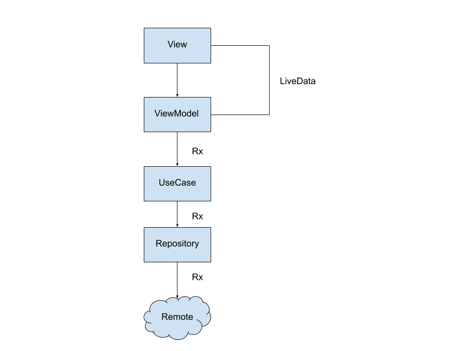
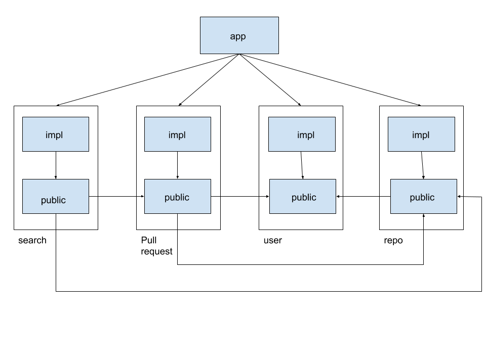

# Github

Aplicativo playground usando:

- MVVM
- Clean Architecture
- Injeção de Dependência
- Alguns conceitos de SOLID, principalmente Inversão de dependência
- Data Binding
- LiveData
- RxJava
- RxAndroid
- Repository
- Modularização
- Testes unitários
- Testes de tela

# Estrutura de chamadas

A estrutura base é usando o pattern Repository para pegar daos remotos e locais com Reactive 
após isso é repassado para o UseCase onde o dado sofre um mapeamento para DTO, para ser usado 
na View. Depois é repassado novamente para o ViewModel que fará tratamento de 
estado(sucesso, erro, carregando ou vazio) além de notificar a View por meio de LiveData. 
Como mostrado na imagem abaixo:

# Estrutura da modularização

Em sumo a modularização pensando em cache de módulos para dimunuir o tempo de build, além de no 
futuro ficar bem mais fácil de colocar o Dynamic-Modules. 
As regras propostas dessa modularização são as seguintes:

* Ao criar uma feature terá dois módulos: public e impl.

    - features podem depender somente do módulo public de outras features.
    
    - módulos impl dependem somente de módulos public nunca de outro impl.
    
    - public contém o que outras features necessitam para seu funcionamento 
      com cautela(afinal Grandes poderes Grandes responsabilidades). Aqui pode ser colocado resources 
      tipo imagens, cores e interfaces(por exemplo a navegação) porém por ser public e sem muitas "funcionalidades"
      aqui não é lugar de injeção de dependência muito menos de testes.
      
    - impl contém toda a lógica da implementação da feature. 
      Aqui entra a injeção de dependencia, testes de tela e algumas outras coisas necessárias para a feature funcionar.
      
    - App é o principal ele conhece todos os impl

Abaixo segue a imagem da modularização:

O projeto também conta com alguns módulos suplementares:
    
    - core-binding: utilitários para data binding por exemplo os @BindableAdapter
    - core-lib: contém classes base de mapeamento além do networking do projeto
    - core-android: utilitários de LiveData, Injeção de Dependencia, Navegação, enum da máquina de estado.
    - design-system: aqui contém os estilos que serão utilizados em TextViews e no futuro
        componentes customizados.
    - ui-utility: possui alguns matchers especificos do RecyclerView, Helper de Mocks e TestRules 
        utilizados em testes instumentizados
    - unit-utility: possui Helper de Mocks e TestRules para testes unitários
    
# Fontes de pesquisa

    - [GDG Talk: Android - Modularização em larga escala](https://www.youtube.com/watch?v=UFmmcUvWoI0)
    - [Breaking Down Modularization](https://www.droidcon.com/media-detail?video=380844229)
    - [Android at Scale @Square](https://www.droidcon.com/media-detail?video=380843878)
    
